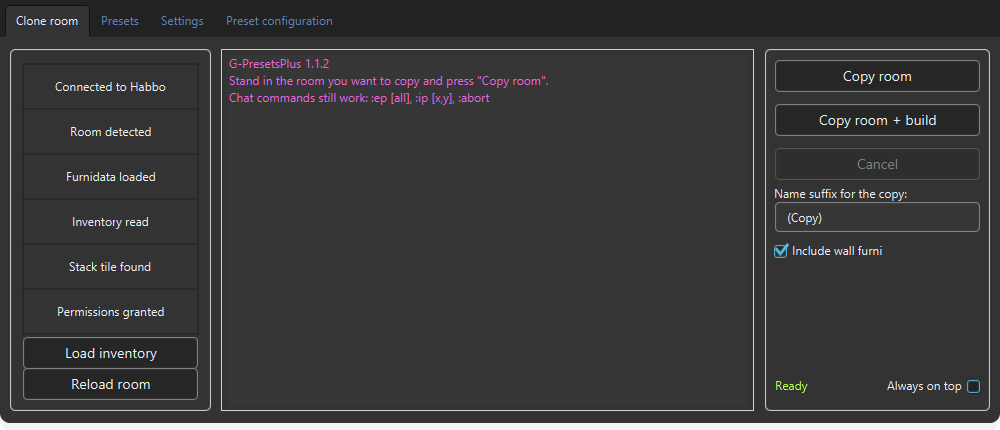
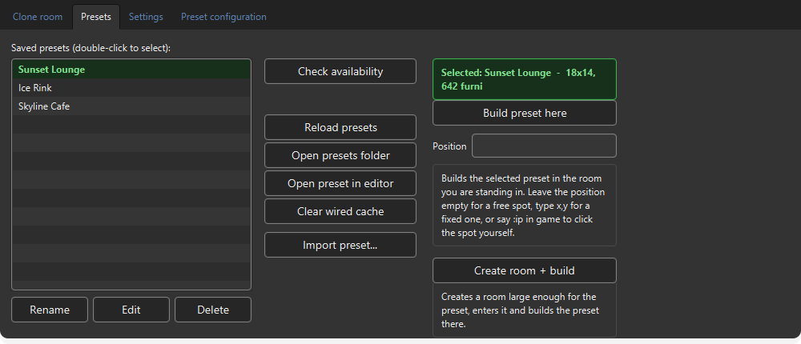
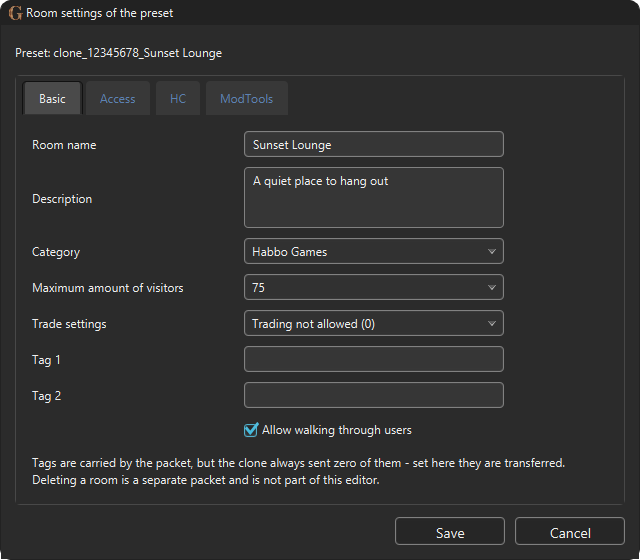
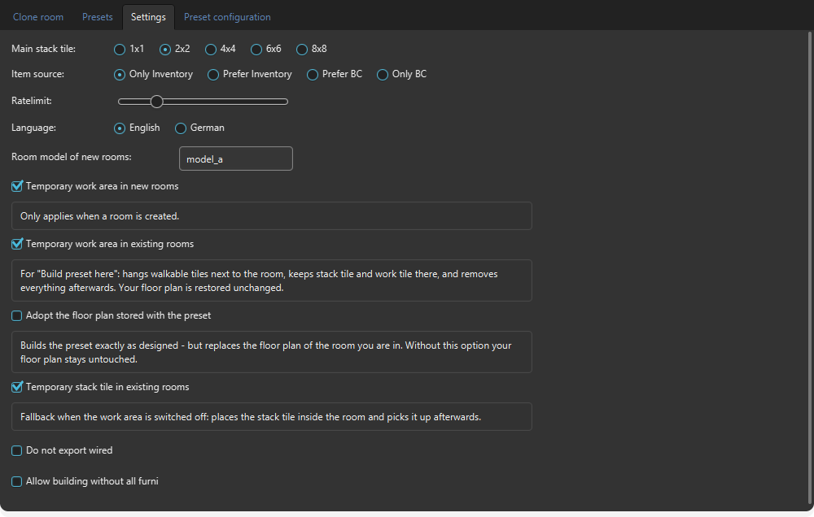

# G-PresetsPlus

A [G-Earth](https://github.com/sirjonasxx/G-Earth) extension that copies a **whole Habbo room** — settings, floor plan, furni and wired — into a freshly created room, in one click.

It merges two existing extensions: [G-Presets](https://github.com/sirjonasxx/G-Presets) knows how to save and rebuild furni and wired, [RoomDuplicator](https://github.com/kouris-h/RoomDuplicator) knows how to read and write a room's settings and floor plan. Neither of them creates the target room — this one does, and then makes it match the original.



## Features

- **Copy room** — exports furni and wired plus a snapshot of the room (settings, floor plan, wall items) as a preset. Builds nothing.
- **Copy room + build** — the same, then creates a room, enters it, writes the floor plan and settings, and rebuilds everything including wired.
- **Create room + build** on the Presets tab — takes any saved preset, creates a room with the original floor plan and settings, and builds it there.
- **Build preset here** — builds a preset into the room you are already standing in. It hangs a temporary work area next to the room, keeps stack tile and work tile out there, builds, and removes it again; your own floor plan comes back unchanged.
- **Import preset** — pick a `.json`, optionally add a floor plan from a `.txt` or paste it into an editor field. The door tile is derived from the plan and the door rule is checked before anything is written.
- **Preset editor** — the room settings of a preset in Habbo's own tab layout (Basic / Access / HC / ModTools). Room categories are read live from the server, not hard-coded.
- Presets are named after the room; a second copy of the same room becomes `Room (1)`, then `Room (2)`.
- Smaller stack tiles are placed alongside the configured one, so furni also fit into gaps the main tile cannot reach. The 1x1 goes on top of the 2x2.
- The saved-presets list shows furni and wired counts per preset, and marks the loaded one in green.
- **Check availability** also estimates how long placing takes and how long the whole build runs, computed from the configured rate limit.
- Progress is reported in the console **and** in game as bot messages, with the overall percentage weighted by the real duration of each phase.
- Furni the server refuses are named with class and tile instead of leaving you with Habbo's *"Sorry, you cannot place this item here"*.
- Rename and delete presets from inside the extension; both files of a preset (`.json` and `.roomJson`) are always handled together.
- English and German, switchable at runtime in the Settings tab - the console log is rewritten in the new language, including lines already printed, and the in-game messages follow too.
- Chat commands from G-Presets still work: `:ep [all]`, `:ip [x,y]`, `:abort`.





## Install

1. Download `GPresetsPlus.jar` from the [latest release](../../releases/latest).
2. In G-Earth, open the **Extensions** tab and install the jar.
3. Stand in the room you want to copy and press **Copy room** or **Copy room + build**.

Requires Java 8 or newer. G-Earth already ships with a suitable runtime.

Tested against Habbo **Flash** on habbo.com with G-Earth 1.5.4-beta-29. Origins/Shockwave is not supported — the packet layouts differ.

## The temporary work area

Rebuilding a preset needs three things inside the room: a stack tile, one free tile to drop furni on, and somewhere for your avatar to stand. If those sit in the room itself, they block the very tiles the preset wants to use — and multi-tile floor furni like the Roller Rink can never go through a stack tile at all.

So the extension appends a temporary area next to the room while building, two tiles larger than the configured stack tile (2×2 → 4×4, 4×4 → 6×6). Stack tile, free tile and the room entry all live there. Afterwards the area is removed and the door is put back where the original had it:

```
Annex 4x4 at 18,1 | door 18,1 | stack tile 2x2 at 18,2 | free space 19,1 | plan 22x5
...
Annex removed, door back at 17,3 dir 2 - the room now matches the original
```

There are two switches for it in the Settings tab, because the two cases are not the same risk.



*Temporary work area in new rooms* applies when a room is **created** — by *Copy room + build* or *Create room + build*. Turn it off if the target room is empty and large enough anyway; the build then looks for space inside the room.

*Temporary work area in existing rooms* applies to *Build preset here*. The room's own floor plan is written back afterwards from the snapshot taken before the build, so the annex is temporary and nothing about your room changes. If no annex fits next to the room — the limit is 55×55 plus the door tile — the build says so instead of doing something else. Without this option, *Temporary stack tile in existing rooms* is the fallback: the stack tile is placed inside the room and picked up again afterwards.

*Adopt the floor plan stored with the preset* is the one option that does change your room: it writes the preset's own floor plan and builds from `0,0`, which is what reproduces a build exactly as designed. It is off by default, and when a preset carries a floor plan the console says so rather than ignoring it silently.

## Notes on the protocol

These were measured against the live server, and they are the reason the clone works at all:

- **`SaveRoomSettings` carries 25 fields, not 24.** RoomDuplicator sends an `int` where a `boolean` belongs from field 19 on, so everything behind it lands in the wrong slot. Field 8 is the **tag count** — sending `0` there silently clears the room's tags.
- **Strings must go out as UTF-8 — in both directions.** G-Earth's `HPacket` writes strings as ISO-8859-1, so `¥` leaves as one byte instead of two and `★` is destroyed into `?`. The server drops such a packet without any error reply. All outgoing strings are re-encoded before sending; if the room name shows up as `Â¥` in G-Earth's packet log, that is the *correct* wire format. The same applies to packets sent **to** the client: a German bot message reaches Habbo as mojibake unless it is re-encoded the same way.
- **Some floor furni must sit on the bare floor.** The Roller Rink (`val11_floor`), rollers, ice, water and holes cannot be placed on top of anything, so they never go through the stack tile. Everything else does — including rugs. Classifying rugs as floor coverings and placing them directly looks harmless and breaks exactly these items, because the rug lands first and the rink can then no longer be placed at all.
- **A default room reports `wallHeight = -1`**, and the server silently discards that value on write. It is clamped to `0`.
- **Floor plans have a door rule.** The first row and the first column may contain at most one walkable tile. A plain rectangle of walkable tiles is rejected with *"Invalid door setup"*, and a plan of only `x` with *"matrix contains only 'x' characters"*.
- **The room password is in no readable packet.** A clone can therefore never carry it over. A room whose door mode is *password* is created as *open* unless you set a password in the preset editor yourself.
- Door modes are `0` open, `1` doorbell, `2` password, `3` invisible — note that this is **not** the order the client dialog lists them in.
- **A `FloorHeightMap` arrives when you enter a room, not only when a floor plan is written.** Treating any incoming heightmap as confirmation reports success for a write that never landed, and the build then places furni on tiles that do not exist. The received plan is compared against the sent one by width, height and walkable tile count.

## Building

Requires a **Java 8** JDK that includes JavaFX (for example [Liberica Full JDK 8](https://bell-sw.com/pages/downloads/#jdk-8-lts)) and Maven.

```
mvn clean package
```

The shaded jar is written to `target/bin/GPresetsPlus.jar`.

**Build with the Java 8 JDK, not just any JDK.** G-Earth picks the runtime for an extension from the `Build-Jdk` manifest entry. Building without `JAVA_HOME` pointing at Java 8 writes `Build-Jdk: 21.x`, G-Earth then starts the extension on its bundled Java 21, and RichTextFX 0.9.3 — the console — dies immediately on an `InaccessibleObjectException`. The extension simply never appears in the list, with no error anywhere in the interface. The manifest therefore also carries `Add-Opens` and `Add-Exports` for the JavaFX packages RichTextFX reflects into, so the jar survives a modular runtime either way.

The G-Earth API is not on Maven Central. Install it into your local repository from your G-Earth folder before the first build:

```
mvn install:install-file -Dfile=G-Earth-Api-1.5.4-beta-29-SNAPSHOT.jar \
    -DgroupId=G-Earth -DartifactId=G-Earth-Api -Dversion=1.5.4-beta-29 -Dpackaging=jar
```

## Credits and licences

This is a fork of **[G-Presets](https://github.com/sirjonasxx/G-Presets)** by sirjonasxx, Roboroads and WiredSpast, merged with code from **[RoomDuplicator](https://github.com/kouris-h/RoomDuplicator)** by WiredSpast and Kouris.

**Neither original repository states a licence.** That means no redistribution terms were granted by their authors, and this fork cannot grant any either — all rights to the original code remain with them. Ask them first if you intend to redistribute this or build on it. If either author objects to this fork, open an issue and it comes down.

Bundled in the released jar:

- [G-Earth](https://github.com/sirjonasxx/G-Earth) extension API by sirjonasxx — MIT
- [commons-io](https://commons.apache.org/proper/commons-io/) — Apache-2.0
- [org.json](https://github.com/stleary/JSON-java)
- [slf4j-api](https://www.slf4j.org/) — MIT

Not affiliated with or endorsed by Sulake.
